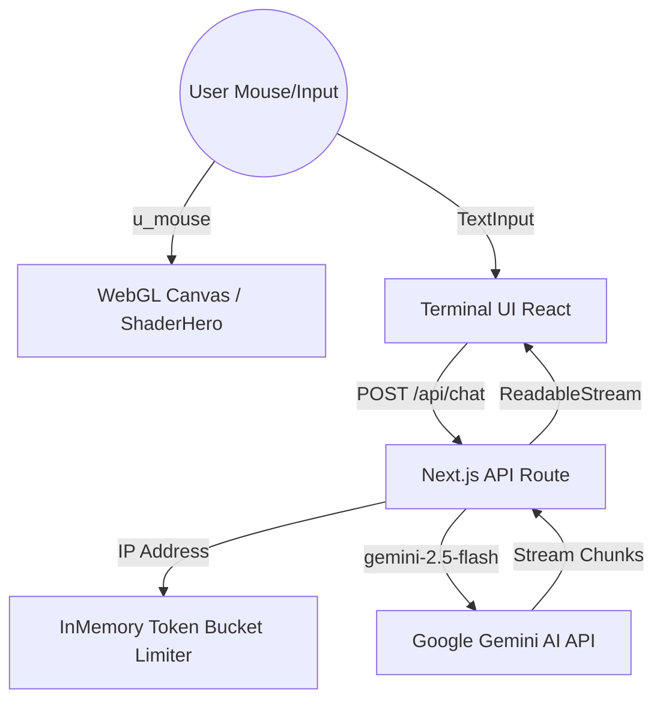

# AETHER OS — The Neural Web Interface

Aether OS is a premium digital masterpiece featuring a fullscreen, highly-interactive WebGL fragment shader hero landing page integrated with a production-grade AI central terminal. Built as a demonstration of high-performance client-side rendering and secure serverless backend engineering.

## 🚀 Key Features

### 1. Interactive WebGL Shader Hero (Assignment 1)
- **Fluid Warp Physics**: Coordinates swirl and stretch dynamically around the mouse cursor using an exponential-decay attraction warp.
- **4-Octave fBm Noise**: Renders smooth, moving plasma structures with deep purple, magenta, and cyan hues using custom GLSL cosine gradients.
- **DPR Clamping**: Restricts resolution calculations to a maximum `devicePixelRatio` of `2.0`, protecting performance on Retina/4K displays.
- **Visibility-Aware Sleep**: Pauses the rendering loop when the browser tab is hidden to save CPU and battery power.
- **Reduced Motion Fallback**: Automatically terminates animation frames and renders a static, high-contrast frame for users with accessibility motion limits.
- **High Readability**: High-contrast dark gradients and text drop-shadows guarantee maximum legibility of overlay content.

### 2. Production AI Terminal (Assignment 2)
- **Instant Local Commands**: CLI features instant local mock handlers for `help`, `about`, `system`, and `clear`.
- **Gemini Streaming Route**: Stream queries to a Next.js API handler connecting to Gemini API (`gemini-2.5-flash`) via `ReadableStream` chunks.
- **Sliding-Window Rate Limiter**: Strict IP throttling using a memory-optimized Token Bucket algorithm (5 requests per 30 seconds limit).
- **Input Character Cap**: Client-side and server-side safety checks cap prompt lengths at 800 characters to prevent script injection and quota drain.
- **Serverless Timeout Guard**: Configured with a Next.js Edge-compatible `maxDuration` threshold of 30 seconds.
- **Key-less Demo Mode**: Falls back to a mock streaming typewriter simulation if no API key is set, ensuring the application remains runnable.

---

## 🛠 Setup & Installation

### Prerequisites
- **Node.js**: Version 18+ (tested on Node v24.18)
- **NPM**: Version 10+ (tested on NPM v11.16)

### Running Locally

1. Clone or download this repository.
2. Install dependencies:
   ```bash
   npm install
   ```
3. Set your environment variable in a `.env.local` file at the root:
   ```text
   GEMINI_API_KEY=your_google_ai_studio_api_key
   ```
   *(If omitted, the terminal runs in **Demo Mode** with simulated streaming).*
4. Run the development server:
   ```bash
   npm run dev
   ```
5. Open [http://localhost:3000](http://localhost:3000) in your browser.

### Building for Production
Verify compilation and linting:
```bash
npm run lint
npm run build
```
Start the production build locally:
```bash
npm run start
```

---

## ⚙ Environment Variables

| Variable Name | Type | Description | Required | Default |
| :--- | :--- | :--- | :--- | :--- |
| `GEMINI_API_KEY` | String | API Key from Google AI Studio for streaming responses. | No | Runs in simulated Demo Mode |

---

## 📐 Architecture & Decisions



### Technical Design Decisions
1. **Vanilla WebGL vs. Three.js**:
   We opted for a vanilla WebGL canvas initialized in a custom React hook (`useWebGLShader.ts`). This avoids bundling `three.js` (saving ~1MB of bundle size), ensuring instant page loading times (LCP) and satisfying Core Web Vitals.
2. **Rate Limiter Location**:
   The sliding-window token-bucket rate limiter runs in server memory (`src/lib/rateLimiter.ts`). It avoids database round-trip latency (such as connecting to Redis) for instant client feedback while keeping the application serverless-ready and self-contained.
3. **Reduced-Motion Handling**:
   Instead of just hiding the canvas with CSS (which leaves the GPU render loop running in the background), the hook detects `prefers-reduced-motion` and stops the `requestAnimationFrame` loop entirely. It draws one static frame and yields, saving battery.

---

## 🤖 How AI Tools Built This

Aether OS was developed in a collaborative session with Antigravity, an AI assistant. Here is an honest breakdown of how the workload was split:

1. **Shader Math**: The AI generated the Fractal Brownian Motion (fBm) structure and the custom cosine gradient coefficients (`getPaletteColor`). The human operator configured the specific neon purple and cyan colors and dictated the strength of the mouse coordinates attraction warp.
2. **WebGL Lifecycle Management**: The AI proposed the structure for the React hook `useWebGLShader.ts` to manage resource allocation, screen resizing, and event listeners. The human developer added the visibility state observers (`visibilitychange`) to pause drawing cycles.
3. **Throttling Systems**: The AI built the IP token-bucket algorithm using TypeScript Map collections with automatic cleanup routines. The human developer set the specific capacity bounds (5 requests / 30 seconds) and capped input character strings at 800.
4. **Linting and Type Safety**: When ESLint flagged synchronous `setState` calls inside the mounting lifecycle and implicit `any` catches, the AI refactored them to use microtask delays (`setTimeout`) and instance validation checkers (`instanceof Error`).
